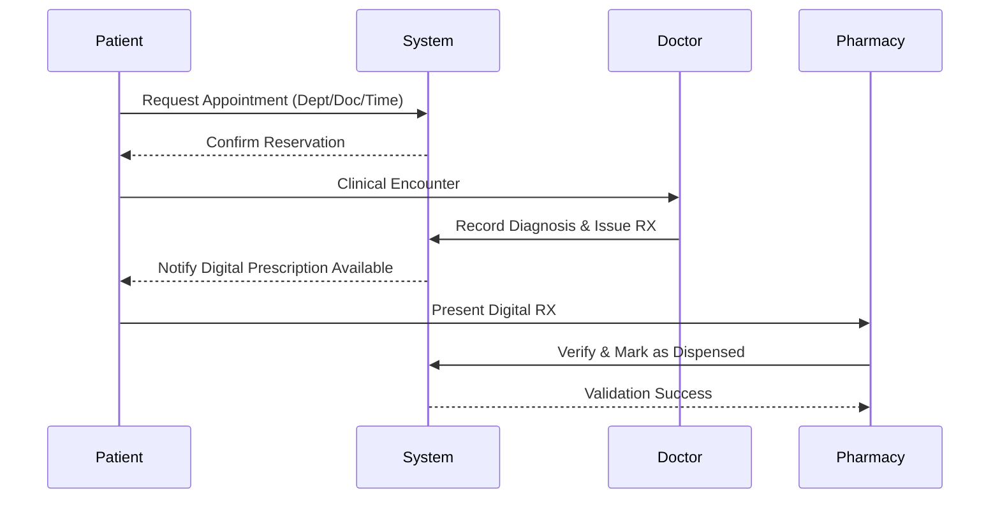
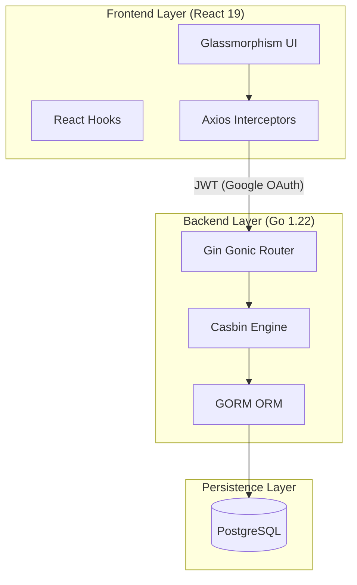

# 🏛️ System Architecture & Design Specification

This document outlines the conceptual, functional, and technical framework of the **Med-Monitor** ecosystem.

---

## 1. 🎯 Executive Overview

Med-Monitor is a high-fidelity medical orchestration platform designed to streamline clinical operations. The system integrates patient scheduling, secure clinical encounters, diagnostic recording, and an end-to-end digital prescription lifecycle.

---

## 2. 👥 Functional Modeling

### 2.1 System Actors & Responsibilities

| Actor | Protocol Responsibilities | Primary Interface |
| :--- | :--- | :--- |
| **Patient** | Appointment scheduling, medical record viewing, RX tracking | Patient Nexus |
| **Doctor** | Clinical diagnostics, encounter processing, treatment issuance | Specialist Dashboard |
| **Admin** | Infrastructure governance, department mapping, role auditing | Command Center |
| **Pharmacist** | *[Extended Scope]* Prescription validation and drug dispensing | Pharmacy Portal |

### 2.2 Operational Workflow

---

## 3. 🛠️ Technical Architecture

The system follows a **Modern Distributed Monolith** pattern, utilizing a decoupled SPA + REST API architecture.

### 3.1 Stack Methodology

- **API Engine**: Engineered in **Go** for high concurrency and low latency.
- **Security Logic**: **Casbin** RBAC implementation for dynamic, logic-based authorization.
- **Persistence**: **PostgreSQL** with a strictly enforced `snake_case` schema.
- **Orchestration**: Fully containerized using **Docker** for environment parity.

---

## 4. 🗄️ Core Data Entities

The relational schema is designed for clinical accuracy and referential integrity:

> [!NOTE]
> All primary identifiers use `uint` increments with secondary indexing on frequently queried foreign keys (`patient_id`, `doctor_id`).

1. **Users**: Central identity management (Auth, Roles).
2. **Departments**: Hierarchical hospital organizational units.
3. **Doctors**: Clinical profile extension (Specialization, Dept Link).
4. **Patients**: Medical detail extension (DOB, Gender, History).
5. **Appointments**: The core scheduling entity (Temporal link).
6. **Consultations**: The immutable record of a clinical encounter.
7. **Prescriptions**: Pharmaceutical directives (Medication, Dosage, Status).

---

## 5. 🚀 Design Principles

- **Zero-Trust**: Every request is verified via JWT and Casbin policies.
- **Reactive UI**: State-driven interface that responds to role-specific capabilities.
- **Standardization**: Strict adherence to RESTful principles and JSON `snake_case` conventions.

---
